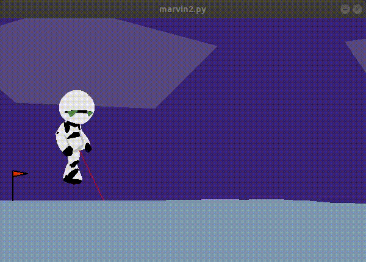

# Walking Marvin (bipedal walker problem)
Remember the sad Marvin from "Hitchhiker's guide to the galaxy"? In this project we train him to walk from the scratch using only pure `python` with `numpy`!


##  Installation guide
To install Marvin environment and dependencies, please, run following shell script:
```shell
> ./install.sh
```
It will install `python3.7` with all dependencies inside the virtualenv named `venv`.

To run Marvin, please, use the following commands:
```shell
> ./marvin.py <-r>
```
or
```shell
> source venv/bin/activate
> python3 marvin.py <-r>
```
Flag `-r` is used for running trained Marvin (by default pretrained model is used)

## Methodology
As main model used fully-connected network as part of `reinforce algorithm` with `policy gradient methodology`.<br>
Model predicts only `mean` of the actions distribution without `standart deviation`. Loss function consist only from predicted mean.

## Results
Basically, Marvin starts from the folowing state:



The pretrained Marvin can walk in the next way:


And in trained state he can moves with the next speed:


## Bibliography
[Policy gradient methodology](https://papers.nips.cc/paper/1999/file/464d828b85b0bed98e80ade0a5c43b0f-Paper.pdf)
